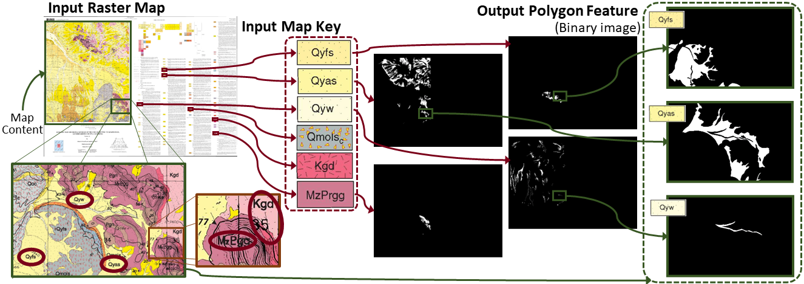
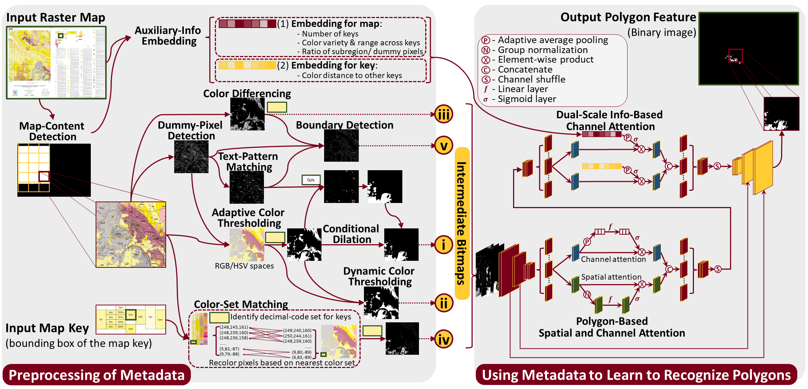

# LOAM

LOAM: Polygon Extraction from Raster Map

[[`Paper`](https://dl.acm.org/doi/10.1145/3589132.3625659)] [[`Video`](#)] [[`BibTeX`](#citation)]

> Exploiting Polygon Metadata to Understand Raster Maps - Accurate Polygonal Feature Extraction. <br>
> Fandel Lin, Craig A. Knoblock, Basel Shbita, Binh Vu, Zekun Li, and Yao-Yi Chiang. <br>
> SIGSPATIAL ’23


## Abstract

Locating undiscovered deposits of critical minerals requires accurate geological data. However, most of the 100,000 historical geological maps of the United States Geological Survey (USGS) are in raster format. This hinders critical mineral assessment. We target the problem of extracting geological features represented as polygons from raster maps. We exploit the polygon metadata that provides information on the geological features, such as the map keys indicating how the polygon features are represented, to extract the features. We present a metadata-driven machine-learning approach that encodes the raster map and map key into a series of bitmaps and uses a convolutional model to learn to recognize the polygon features. We evaluated our approach on USGS geological maps; our approach achieves a median F1 score of 0.809 and outperforms state-of-the-art methods by 4.52\%.


## Introduction

We address the problem of extracting geological features represented as polygons from raster maps. The input includes (1) a raster map and (2) a raster image of the map key from the map legend in the raster map. The output is a binary image for each geological feature in the raster map. We use 1s to represent the extracted polygon feature in the binary image.

<p align="center" width="100%">
    
</p>


The presented LOAM is a two-stage approach that exploits the polygon metadata to extract geological features from raster maps. Our method generates multiple representations of the map for each map key. These representations capture different aspects of map understanding, such as extracting polygon features based on colors, textual descriptions, and boundaries. Our method then leverages these representations to adaptively extract polygon features from maps of diverse styles.

<p align="center" width="100%">
    
</p>


## Environment

### Create from Conda Config

```
conda env create -f environment.yml
conda activate loam
```

### Create from Separate Steps
```
conda create -n loam python=3.9.16
conda activate loam

conda install pytorch torchvision==1.13.1 torchaudio==0.13.1 cudatoolkit=11.7 -c pytorch
pip install -r requirements.txt
```


## Usage

### Phase 1 - Preprocessing of Metadata

Setup `targeted_map.csv` for the index to the training/ testing(extracting) raster maps

Run `metedata_preprocessing.ipynb` for generating intermediate bitmaps. The output for this section will default to an automatically created folder `\Solution_0517`.

Run `postprocessing_for_bitmap.ipynb` for post-processing intermediate bitmaps to support the polygon-recognition model.


### Phase 2 - Using Metadata to Learn to Recognize Polygons

#### Training and Extracting with Predefined Indexes to USGS Maps

Setup `targeted_map_validation.csv` and `targeted_map_testing.csv` for the index to the training/ testing(extracting) raster maps, respectively.

Run `.ipynb` to train the polygon-recognition model and extract polygonal features from raster maps.

* Note that the datasets are not included in the repo, please refer to the [USGS Maps](#dataset).


#### Extracting with a Pretrained Model

Run the following to exploit the polygon-recognition model for extracting polygonal features from raster maps.

```
python 
```


## Dataset

[DARPA Critical Mineral Assessment Competition - Map Feature Extraction Challenge](https://criticalminerals.darpa.mil/The-Competition)

```
@dataset{cma2023data,
  author    = {Goldman, M.A. and Rosera, J.M. and Lederer, G.W. and Graham, G.E. and Mishra, A. and Yepremyan, A.},
  title     = {Training and validation data from the AI for Critical Mineral Assessment Competition},
  year      = {2023},
  doi       = {10.5066/P9FXSPT1},
  publisher = {U.S. Geological Survey data release},
}
```

From the competition datasets, we use the validation datasets to train the polygon-recognition model, and use the testing dataset to examine the performance. Please refer to [our paper](https://dl.acm.org/doi/10.1145/3589132.3625659) for details regarding the evaluation.

[Competition Leaderboard (October 2022)](https://web.archive.org/web/20221202080740/https://criticalminerals.darpa.mil/Leaderboard)


## Citation

Details for BibTeX to be determined.

```
@InProceedings{,
  title     = {Exploiting Polygon Metadata to Understand Raster Maps: Accurate Polygonal Feature Extraction},
  author    = {Lin, Fandel and Knoblock, Craig A and Shbita, Basel and Vu, Binh and Li, Zekun and Chiang, Yao-Yi},
  booktitle = {Proceedings of the 31st ACM International Conference on Advances in Geographic Information Systems (SIGSPATIAL '23)},
  pages     = {},
  year      = {2023},
  doi       = {10.1145/3589132.3625659}
}
```
